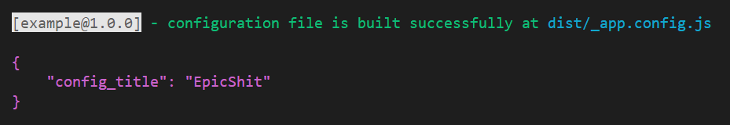

# create-config

CC(create-config) is a tool to generate a front-app-configuration-file for web pages' deployment.



## Get Started

```bash
npm i --save-dev create-config
```

add a quick script in `package.json`:

```json
{
  "scripts": {
    "config": "create-config"
  }
}
```

If you have a `.env` file, and there are variables starts with `config_`

```
config_XXXX=XXXX
```

After run `npm run config`, then you can find `dist/_app.config.js` contains the content:

```js
window.APP_CONFIG = {
  config_XXXX: "XXXX",
};
Object.freeze(window.APP_CONFIG);
Object.defineProperty(window, "APP_CONFIG", {
  configurable: false,
  writable: false,
});
```

Or your can custom your own prefix by additional `-x`, for example:

```json
{
  "scripts": {
    "config": "create-config -x VITE_"
  }
}
```

### Usage

1. Modify your html entry file manually or by tools like webpack.

```html
<script src="./_app.config.js"></script>
```

2. Using global config data in condition.

```js
function getGlobalConfig() {
  if (process.env.NODE_ENV === "production") return window["APP_CONFIG"];
  // ... otherwise
}
```

## Further

### Javascript API

**You will rarely to use this. It's recommended to use in the npm-scripts way.**

Use in your node code, usually at `post-build` stage. Provide the `config` object.

```js
const { createConfig } = require("create-config");

createConfig({
  config: {
    config_api_url: "http://localhost:8080",
  },
});
```

#### options

| key            | default            | description                                    |
| -------------- | ------------------ | ---------------------------------------------- |
| config         | -                  | required                                       |
| output         | `"dist"`           | -                                              |
| configName     | `"APP_CONFIG"`     | -                                              |
| configFileName | `"_app.config.js"` | -                                              |
| prefix         | `"config_"`        | case sensitive; if you use vite, maybe `VITE_` |
| packageName    | -                  | `npm_package_name + npm_package_version`       |

### CLI

We provided a CLI for convenience when using `npm-scripts`.

Here is the options(you can get the list by `npx create-config --help`):

```
  -o, --output <string>            output directory where to put the generated file (default: "dist")
  -f, --config-file-name <string>  filename of the generated file (default: "_app.config.js")
  -n, --config-name <string>       the key name of global(window) (default: "APP_CONFIG")
  -x, --prefix <string>            only keys start with the prefix would be preserved (default: "config_")
  -h, --help                       display help for command
```

### Without `dotenv`

It's recommended to use `dotenv`, which is used widely in modern front-end dev environments.
We automatically read configs from your `.env.production | .env` file.

Besides, there is one more way without `dotenv`. A `appConfig.json` at root is also available.

```
| - appConfig.json
| - .env.production
| - .env
```
